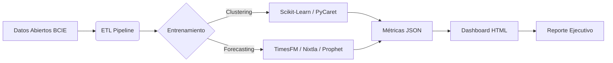

# Laboratorio de Machine Learning: Datos Abiertos del BCIE

Repositorio oficial de experimentos y pipelines de Machine Learning aplicados a los datos abiertos del Banco Centroamericano de Integración Económica (BCIE). Este proyecto demuestra cómo transformar datos públicos en inteligencia predictiva y segmentación estratégica.

---

## 🚀 Modelos Implementados y Resultados

El laboratorio ha operacionalizado **12 modelos avanzados**, divididos en dos grandes áreas de estudio: Segmentación de Cartera (Clustering) y Proyección de Aprobaciones (Forecasting).

### 1. Segmentación de Cartera (Clustering)

_Objetivo: Identificar perfiles de comportamiento financiero en las aprobaciones._

| Modelo           | Metodología            | Resultado Óptimo      | Perfiles Identificados                                                                                       |
| :--------------- | :--------------------- | :-------------------- | :----------------------------------------------------------------------------------------------------------- |
| **DBSCAN**       | Densidad (Grid Search) | **3 Tiers + Ruido**   | **Tier A:** Regular (Media ~30M) **Tier B:** Alto Valor/Freq (~65M) **Tier C:** Micro Créditos (~441K) |
| **K-Means**      | Particional (Elbow)    | **K=4 Clusters**      | Segmentación rígida equilibrada.                                                                             |
| **Hierarchical** | Aglomerativo (Ward)    | **K=4 Clusters**      | Estructura anidada de sub-grupos.                                                                            |
| **Mixed**        | Votación (Ensemble)    | **K=3 Clusters**      | Consenso estable entre algoritmos (Score 0.85).                                                              |
| **HDBSCAN**      | Densidad Adaptativa    | **14 Micro-clusters** | Detección de nichos muy específicos (26% ruido).                                                             |

> **Highlight:** La optimización de **DBSCAN** (`eps=0.25`, `min_samples=10`) logró aislar el 14% de operaciones atípicas (ruido), permitiendo una limpieza automática de la data para análisis estratégicos.

### 2. Proyección de Aprobaciones (Forecasting)

_Objetivo: Predecir volúmenes de aprobación por país y sector._

| Modelo            | Enfoque                    | Metodología                | Desempeño Destacado                       |
| :---------------- | :------------------------- | :------------------------- | :---------------------------------------- |
| **TimesFM**       | **IA Generativa (Google)** | Foundation Model Zero-Shot | **MAPE < 30%** en Costa Rica y Argentina. |
| **StatsForecast** | **Ensemble Estadístico**   | AutoARIMA + Theta (50/50)  | Intervalos de confianza robustos (80%).   |
| **Prophet**       | Modelo Aditivo             | Tendencia + Estacionalidad | Baseline explicable para negocio.         |
| **NeuralProphet** | Híbrido (AR-Net)           | Red Neuronal + Componentes | Captura de no-linealidades complejas.     |

---

## 🛠️ Arquitectura Técnica

Cada modelo sigue una arquitectura modular estandarizada para garantizar reproducibilidad y mantenibilidad:

### Estructura del Repositorio

La estructura real del proyecto se organiza por modelo en el directorio `models/`:

- `models/aprobaciones_dbscan_2026/` (Ejemplo de Clustering)
  - `config/`: Hiperparámetros (`eps`, `min_samples`).
  - `src/pipelines/`: Lógica de entrenamiento.
  - `src/dashboard/`: Generación de reportes HTML.
  - `data/04-predictions/`: Resultados, perfiles y métricas.

- `models/aprobaciones_TimesFM_2026/` (Ejemplo de Forecasting)
  - `src/pipelines/`: Backtesting y Cross-Validation.
  - `data/05-evaluation/`: MAPEs y errores por país.

---

## 📊 Visualización y Dashboards

Todos los modelos generan automáticamente **Dashboards Interactivos** (HTML/Plotly) que permiten explorar:

- **Clustering:** Gráficos de dispersión (PCA/t-SNE), perfiles de radar y tablas de centroides.
- **Forecasting:** Gráficos de series temporales con intervalos de confianza y selectores dinámica por país/sector.

---

## 📚 Documentación Adicional

Para un desglose técnico profundo, metodologías de optimización detalladas y auditoría de estado de cada componente, consulta el documento maestro:

👉 **[AUDITORIA_MODELOS.md](models/AUDITORIA_MODELOS.md)**

---

_Proyecto desarrollado como parte del Laboratorio de Inteligencia Artificial Aplicada._
